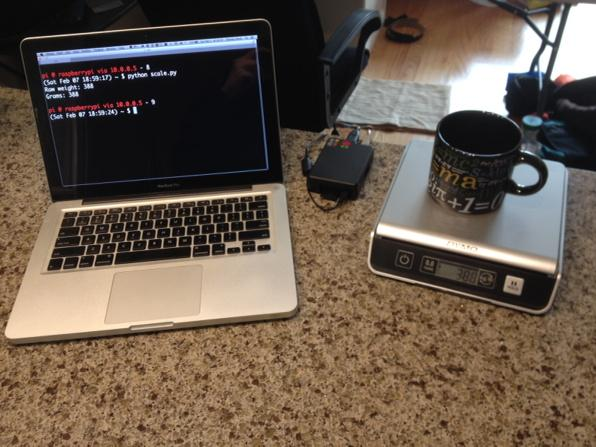

# dymouse

Dymouse is a library for interfacing with a Dymo USB postage scale 
via Raspberry Pi, Python, Flask, and a REST API.

## How Does It Look?



## How It Works

The way dymouse works is, you hook up your Dymo USB postage scale
to your Raspberry Pi using a USB cable.

You then install Python on your Raspberry Pi, and use Python
to take readings from the scale. 

By running a Flask web server in Python, 
and writing the USB postage scale drivers in Python, 
readings of the Dymo USB postage scale can be made available 
through a REST API, making the Dymo scale an internet-capable
instrument, and an internet of things thing.

## Layout

dymosue is a Python module that is comprised of two sub-modules.

The submodules in dymouse are:

* ```dymouse.webserver``` - submodule for running the Flask
    web server; this submodule provides both a web page interface
    and a JSON-based REST API.

* ```dymouse.driver``` - submodule for creating a Python object
    representing the scale; this submodule actually grabs the 
    raw weight readings from the scale and turns them into 
    something sensible and useful.

